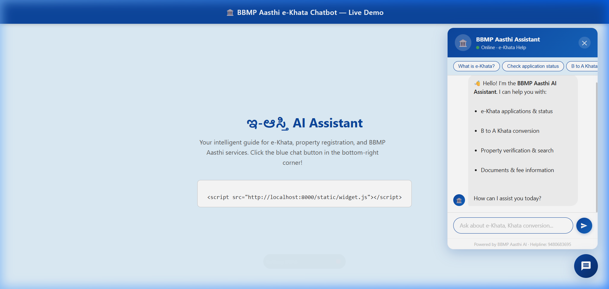
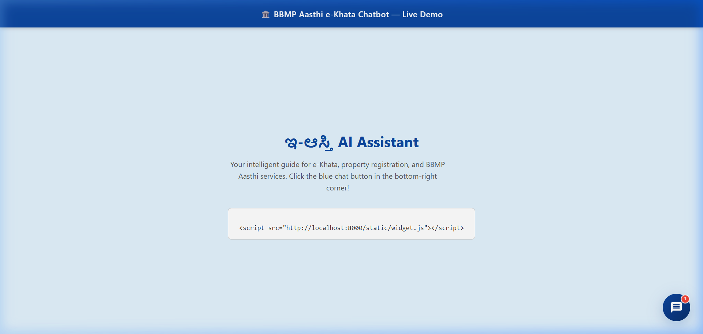
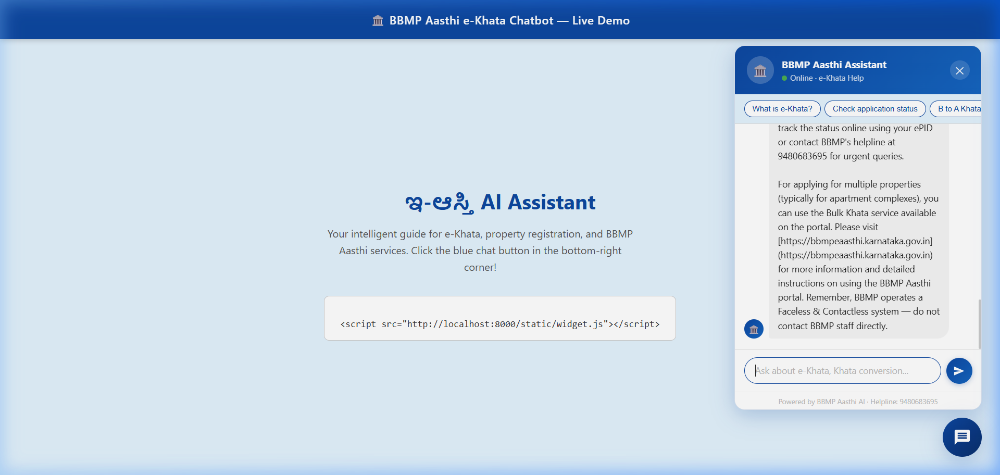
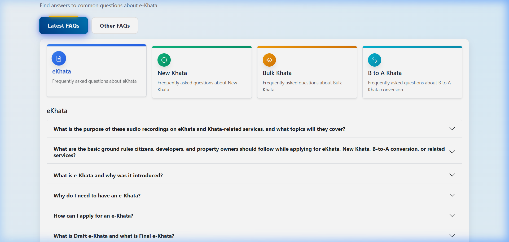

# BBMP Aasthi e-Khata Chatbot 🏛️

> A locally-run, privacy-first AI chatbot for the [BBMP Aasthi](https://bbmpeaasthi.karnataka.gov.in) portal — powered by Mistral LLM + RAG.



---

## ✨ Features

- 🤖 **RAG-powered** — answers grounded in real BBMP Aasthi FAQ content
- 🔒 **Fully local** — no cloud APIs, no data leaves your machine
- ⚡ **Streaming responses** — tokens appear in real-time as AI generates
- 💬 **Conversation memory** — remembers context across follow-up questions
- 🎨 **BBMP-themed UI** — matches the portal's blue `#0d47a1` design
- 📎 **Embeddable** — one `<script>` tag works on any website
- 🏷️ **Question labels** — each bot reply shows which question triggered it
- 📜 **Scrollable quick chips** — 6 common question shortcuts

---

## 📸 Screenshots

### Homepage Demo Page


### Chat Panel — Open


### Live Bot Response — "What is e-Khata?"


### Live Bot Response — "How do I check application status?"


### BBMP Aasthi Website FAQs (Source of Knowledge)


---

## 🏗️ Architecture Overview

```
Citizen Browser
    │ WebSocket (streaming)
    ▼
FastAPI Backend (main.py)
    │
    ├──► RAG Pipeline (rag.py)
    │         ├── ChromaDB (vector search)
    │         └── Ollama mistral (text generation)
    │
    └──► Static Files → widget.js / widget.css
```

See [ARCHITECTURE.md](ARCHITECTURE.md) for the full detailed architecture.

---

## 🚀 Setup

### Prerequisites
- Python 3.9+
- [Ollama](https://ollama.com) installed and running

### Install

```bash
# 1. Install dependencies
pip install -r requirements.txt

# 2. Pull Ollama models
ollama pull mistral
ollama pull nomic-embed-text

# 3. Build the knowledge base
python scraper.py
python ingest.py

# 4. Start the server
uvicorn main:app --port 8000
```

Open **http://localhost:8000** to test.

---

## 🔌 Embed on Any Website

```html
<script src="http://localhost:8000/static/widget.js"></script>
```

The floating blue chat button will appear automatically in the bottom-right corner.

---

## 📁 Project Structure

```
bbmp-chatbot/
├── main.py              → FastAPI server + WebSocket streaming
├── rag.py               → RAG pipeline (ChromaDB + Ollama)
├── scraper.py           → FAQ scraper + manual knowledge base
├── ingest.py            → Embed knowledge into ChromaDB
├── ARCHITECTURE.md      → Detailed system architecture
├── static/
│   ├── widget.js        → Embeddable chat widget
│   └── widget.css       → BBMP-themed styles
├── docs/
│   └── screenshots/     → UI screenshots
├── knowledge_base/      → Raw text (auto-created on first run)
└── chroma_db/           → Vector store (auto-created on first run)
```

---

## 🛠️ Tech Stack

| Component | Technology |
|---|---|
| LLM | Mistral (via Ollama, local) |
| Embeddings | nomic-embed-text (via Ollama) |
| Vector Store | ChromaDB |
| RAG Framework | LangChain |
| Backend | FastAPI + uvicorn |
| Frontend | Vanilla JS + CSS |

---


- **Portal**: https://bbmpeaasthi.karnataka.gov.in

---

*Built for BBMP Bruhat Bengaluru Mahanagara Palike — Bengaluru, Karnataka, India*
